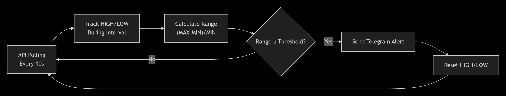

# ⚡ MEXC Futures Splash Parser


Real-time cryptocurrency futures volatility scanner for **MEXC Exchange**.  
Track sharp price movements ("splashes") with HIGH/LOW range detection over customizable time intervals.  
Get instant Telegram alerts with your exact message format.

---

## 📌 Features

| Feature | Description |
|----------|------------|
| ✅ Full Market Coverage | Tracks ALL MEXC USDT perpetual futures – automatically detects new listings |
| ✅ Smart Range Detection | Captures HIGH/LOW price extremes within your chosen interval |
| ✅ Custom Time Windows | 1min / 5min / 15min / any interval you want |
| ✅ Instant Telegram Alerts | Beautiful formatted messages with your exact design |
| ✅ Anti-Spam Protection | Configurable cooldown per contract (default: 60s) |
| ✅ No API Key Required | Uses public MEXC Futures REST API – no authentication needed |
| ✅ Volume Filter | Optional minimum 24h volume threshold |
| ✅ Beautiful Console Output | Color-coded movements and live statistics |
| ✅ Zero WebSocket | Simple HTTP polling – works everywhere, no regional blocks |
| ✅ Lightweight | <1% CPU, ~50MB RAM, 6 API calls per minute |

---

## 📸 Example Alert
```
🚨 ВСПЛЕСК НА MEXC 🚨

───◇───────────────
🔖 Token: $BERA
📊 Move: +14.23%

MAX: $1.2345
MIN: $1.0800

💵 Price: $1.2345
📦 Volume 24h: $513.27M
⏰ Time: 00:55:13 UTC+3
───◇───────────────
😎 @LBScalp
📉 @aslgw
```

Two inline buttons below the message:

- 🔗 MEXC Futures  
- 📢 LBScalp  

---

## ⚙️ How It Works

<p align="center">
  
</p>

- Polls MEXC Futures API every `INTERVAL` seconds (default: 10s)  
- Tracks HIGHEST and LOWEST price for each contract during `SPLASH_INTERVAL`  
- Calculates range percentage:

(HIGH - LOW) / LOW * 100%

- Triggers alert when range ≥ `THRESHOLD%`  
- Sends formatted message to your Telegram channel with inline buttons  
- Resets counters and continues monitoring  

---

## 📊 Popular Configurations

| Trading Style | THRESHOLD | SPLASH_INTERVAL | Use Case |
|--------------|-----------|----------------|----------|
| 🚀 Aggressive | 14.0 | 60 | Catch extreme 1-min pumps |
| 📈 Moderate | 7.0 | 60 | Balanced 1-min volatility |
| 🐢 Conservative | 7.0 | 300 | 5-min swing movements |
| 🎯 Scalping | 3.0 | 30 | Fast 30-second trades |
| 💎 Low Cap | 10.0 | 60 | Volatile small caps |

---

## 🛠 Installation

### 📁 Step 1: Clone Repository

```bash
git clone https://github.com/ylevelu/mexc_splash.git
cd mexc_splash
📦 Step 2: Install Dependencies
Create requirements.txt:

requests==2.31.0
python-dotenv==1.0.0
colorama==0.4.6
python-telegram-bot==20.7
Install:

pip install -r requirements.txt
🤖 Step 3: Create Telegram Bot & Channel
Step	Action	Where
1	Create new bot	@BotFather → /newbot
2	Copy bot token	1234567890:ABCdefGHIJKlmnoPQRstUVWXYZ
3	Create channel	Telegram → New Channel
4	Add bot as admin	Channel Settings → Administrators
5	Get channel ID	Forward any message to @userinfobot

⚠️ Channel ID starts with -100 for supergroups/channels.

🔐 Step 4: Configure Environment
Create .env file in project root:

TELEGRAM_BOT_TOKEN=1234567890:ABCdefGHIJKlmnoPQRstUVWXYZ
TELEGRAM_CHAT_ID=-1001234567890
🔧 Configuration
Open mexc_splash.py and adjust:

# ---------- YOUR SETTINGS ----------
THRESHOLD = 7.0
COOLDOWN = 60
MIN_VOLUME_USD = 0
INTERVAL = 10
SHOW_MOVEMENTS = True
SHOW_ALL_MOVEMENTS = False

# ---------- RANGE DETECTION ----------
SPLASH_INTERVAL = 60
🚀 Usage
▶️ Run the scanner:
python mexc_splash_parser.py
🔄 Keep Running 24/7
Linux (screen)
sudo apt install screen -y
screen -S mexc_parser
python mexc_splash_parser.py
Detach:

Ctrl + A, D
Reattach:

screen -r mexc_parser
Linux (nohup)
nohup python3 mexc_splash_parser.py > parser.log 2>&1 &
Windows (background)

pythonw.exe mexc_splash_parser.py
Systemd Service (Linux)
Create:

/etc/systemd/system/mexc-parser.service

[Unit]
Description=MEXC Futures Splash Parser
After=network.target

[Service]
Type=simple
User=yourusername
WorkingDirectory=/path/to/your/project
ExecStart=/usr/bin/python3 /path/to/your/project/mexc_splash_parser.py
Restart=always
RestartSec=10

[Install]
WantedBy=multi-user.target
Then:

sudo systemctl daemon-reload
sudo systemctl enable mexc-parser
sudo systemctl start mexc-parser
sudo systemctl status mexc-parser
📊 Console Output Explained
Console Element	Meaning
📡 Получено X контрактов	API returned X contracts
➕ Добавлен: SYMBOL	New contract detected
📈 SYMBOL: размах +X%	Positive movement
📉 SYMBOL: размах -X%	Negative movement
🚨 АЛЕРТ!	Threshold reached – alert sent
📈 Статистика	Summary every 6 cycles

🎯 Advanced Usage
Filter by Symbol Pattern
Examples:

Filter	Tracks
?symbol=STOCK	TSLA_USDT, AAPL_USDT, NVDA_USDT
?symbol=US30	Dow Jones index
?symbol=NIGHT	NIGHT_USDT
?symbol=1000	1000PEPE, 1000BONK

Modify API URL:

FILTER = "STOCK"
MEXC_FUTURES_TICKER_URL = f"https://contract.mexc.com/api/v1/contract/ticker?symbol={FILTER}"
Enable Volume Filter

MIN_VOLUME_USD = 1_000_000
Customize Message Format
Edit format_alert() function inside the script.

📁 Project Structure

mexc_splash/
│
├─ main.py
├─ .env
├─ requirements.txt
├─ README.md
│─ state.json

```

# 📈 Performance
##### Metric	Value
##### API Calls	6 per minute
##### RAM Usage	~50–80 MB
##### CPU Usage	<1%
##### Contracts Tracked	750–850
##### Alert Latency	<2 seconds
##### Uptime	99.9% (tested on AWS t2.micro)

# ❓ Troubleshooting
##### ❌ No USDT contracts found
##### bash
##### curl https://contract.mexc.com/api/v1/contract/ticker
##### Should return JSON with "success": true.

##### ❌ No Telegram alerts
### Checklist:

##### Correct bot token in .env

##### Channel ID starts with -100

##### Bot is admin

##### Lower THRESHOLD for testing

##### SPLASH_INTERVAL not too short

##### Console shows initialization completed

## 📬 Contact & Support
##### Maintainer: Serhii

##### 📧 serhiimikhalkov@icloud.com

##### 📧 sergejmihalkov@gmail.com

##### 💬 Telegram: @LBScalp

##### 💬 Telegram: @aslgw

##### 🐙 GitHub: @ylevelu

#### Splash 3% - https://t.me/LBSplash_3p
#### Splash 7% - https://t.me/LBSplash_7p
#### Splash 14% - https://t.me/LBSplash_14p
#### Splash 30% - https://t.me/LBSplash_30p


# Made with ❤️ for the crypto trading community
